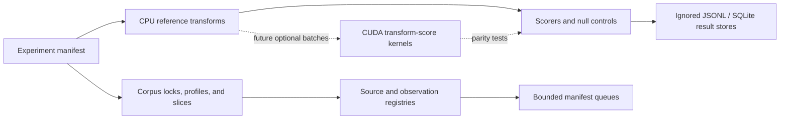

# Architecture

## Design Principles

The workbench favors reproducibility, provenance, and skeptical review over speed. Generated output is review material, not evidence of a solve. GPU acceleration is useful only after CPU behavior is correct, testable, and stable.

## Current Repository State

Stage 4Q is complete after the Stage 3W through Stage 4P infrastructure chain. The canonical corpus is inactive, page boundaries are reviewable, broad unsolved-page campaigns are not started, and CUDA is deferred to Stage 5A planning/scaffolding only. No solve claim is made.

Historical Stage 0A was a bootstrap scaffold. The current repository now includes profile/corpus candidate foundations, solved fixtures, CPU transform registry, result-store foundations, bounded execution policy, archive/image/Discord/post-Discord/stego modules, and raw-data-free CI.

## Component Graph

## CPU/GPU Responsibility Split

The CPU owns corpus management, profile loading, hypothesis generation, bounded experiment orchestration, provenance, scoring, validation, and review. The GPU may later accelerate large regular transform-and-score batches only after CPU references, batch APIs, parity tests, and benchmarks exist.

Existing CUDA code is scaffold and smoke-test infrastructure unless a future stage explicitly adds a CPU-parity-tested kernel.

## Corpus And Profile Layer

Gematria, separator, and glyph-variant profiles are committed and locked. Corpus candidates and page-boundary records remain non-canonical until a future corpus activation stage. Raw source material remains immutable and ignored unless explicitly promoted through source-lock metadata.

## Transform And Experiment Layer

Solved-baseline transforms are CPU reference implementations registered for manifest-addressable replay. Bounded exploratory and post-Discord stages add manifest-scoped executors only; they do not start broad search campaigns.

## Scoring Layer

Stage 3C introduced calibrated scoring for bounded review candidates. The scorer is used to sort and label bounded outputs, not to claim solves. Null controls, positive controls, and conservative confidence labels remain required for any future scored campaign.

## Result Sink

JSONL and SQLite result stores exist as generated outputs. They are ignored by Git and must not be committed. Committed records are limited to schemas, manifests, source locks, curated observation metadata, aggregate summaries, tests, docs, and summary research logs.

## Source And Observation Modules

Stage 3K through Stage 3V added source/visual/web observations, image metadata and transforms, Discord ingestion/review/promotion, post-Discord bounded executors, and OutGuess regression harness metadata. These modules preserve provenance and review status. They do not activate a canonical corpus, finalize page boundaries, publish raw logs/images, or claim solves.

## Testing Layer

CI is raw-data-free, CUDA-free, secret-free, and does not upload generated artefacts by default. Tests cover schema validation, manifest safety, bounded executor behavior, fake-tool stego behavior, ignored-output policy, documentation status, Stage 3W anti-drift checks, and Stage 4Q benchmark-planning validation.

## Failure Modes

Primary risks are false positives, stale context, transcript drift, silent rune-table changes, generated outputs treated as evidence, raw/private data leakage, and GPU code diverging from CPU references. Stage 3W adds anti-drift checks to catch stale operational docs before contributors or Codex sessions act on obsolete assumptions.
