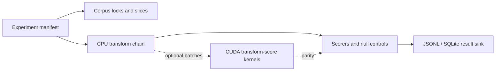

# Architecture

## Design principles

The workbench favors reproducibility, provenance, and skeptical review over speed. GPU acceleration is useful only after the CPU behavior is correct and testable.

## System overview

The planned system has a corpus layer, transform registry, scoring layer, manifest runner, result sink, and optional CUDA batch accelerator.

## Component graph

## CPU/GPU responsibility split

The CPU owns corpus management, hypothesis generation, branching search, experiment orchestration, provenance, and review. The GPU only accelerates large regular transform-and-score batches.

## Pipeline vs internal DAG model

User-facing manifests describe a linear transform chain. Internally, later stages may model shared branches as a DAG for caching, but outputs must still be explainable as a pinned chain.

## Corpus layer

The corpus layer will load immutable raw evidence through locks and produce versioned normalized views. Stage 0A has no corpus loader.

## Transform layer

Transforms will be CPU reference implementations first. CUDA implementations are optional accelerators, not alternate truth.

## Scoring layer

Scorers will produce structured score breakdowns, null-control comparisons, and review hints. Stage 0A has no scoring logic.

## Experiment runner

The runner will consume YAML manifests and write ignored generated outputs. Stage 0A includes only a non-cryptanalytic smoke manifest.

## Result sink

JSONL and SQLite are planned result formats. The schema is documented but not finalized.

## CUDA layer

CUDA is guarded by `LPGPU_ENABLE_CUDA`. The default target architecture is compute capability 8.9 for RTX 4060 Ti.

## Testing layer

Tests begin with scaffold smoke checks. Later stages add golden fixtures, property tests, fuzz tests, manifest determinism tests, and CPU/GPU parity tests.

## Failure modes

Primary risks are false positives, transcript drift, silent rune-table changes, result files treated as evidence, and GPU code diverging from CPU references.

## Stage 0A scaffold limitations

There is no real cipher module, corpus import, search engine, scoring model, or finalized result schema in Stage 0A.
